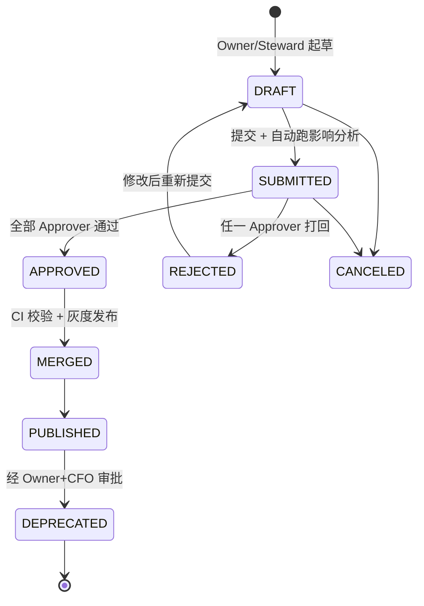

# 指标变更工作流（治理流程）

## 1. 状态机



## 2. 变更类型与审批矩阵

| 变更类型 | 触发场景 | 必要审批 | 通知对象 | 灰度策略 |
|----------|----------|----------|----------|---------|
| **CREATE** | 新增指标 | Owner + 数据负责人 | 数据团队 | 直接发布 PUBLISHED |
| **FORMULA** | 修改公式/口径 | Owner + CFO + 数据负责人 | 全部 Subscriber + 客户 | 新旧版本并行 90 天 |
| **RENAME** | 重命名 / 同义词 | Owner | Subscriber | 立即生效 |
| **DEPRECATE** | 废弃 | Owner + CFO + 法务 | 全部 Subscriber + 客户 | 60 天公告期 |
| **SLA** | 调整新鲜度/可用性 | Owner + 平台负责人 | Subscriber | 立即生效 |
| **OWNER** | 转交负责人 | 原 Owner + 新 Owner | Subscriber | 立即生效 |
| **SENSITIVITY** | 敏感度变更 | Owner + CFO | Subscriber + 计费团队 | 影响计费, 走灰度 |

## 3. 影响分析（提交时自动跑）

```
变更指标 X 提交时:
  1. 解析 metric_def 中所有 requires_metrics 引用 X 的指标 → 下游指标列表
  2. 扫 metric_usage_ref (ref_type=DASHBOARD)        → 看板列表
  3. 扫 metric_usage_ref (ref_type=SAVED_QUERY)      → 保存的查询
  4. 查询近 7 天 chat_message.metrics_used 包含 X    → AI 会话次数
  5. 检查 billing 规则 bizToken_multiplier 引用       → 计费影响
  6. 查 metric_subscription 订阅者数
  7. 试算新旧公式在样例时间段的差异 → 差异百分比

输出 impact_summary.risk_level:
  - LOW    : 下游=0 看板=0 调用<10 与差异<5%
  - MEDIUM : 下游<=2 看板<=3 调用<100 与差异<20%
  - HIGH   : 上述任一超阈值
  - CRITICAL: 涉及计费规则 / sensitivity=HIGH / 差异>50%

推荐审批人 = 默认 approvers + 如果 risk_level >= HIGH 自动加 CFO + 法务
```

## 4. 通知机制

- **变更提交**：通过 Webhook 发送给 `推荐审批人`，IM(钉钉/企业微信) + 邮件双通道。
- **变更通过**：发给所有 Subscriber。
- **变更合并/发布**：Subscriber 收到带新版本号的 changelog。
- **废弃公告**：60 天倒计时，每周一次提醒，最后 7 天每日提醒。
- **SLA 告警**：超时立即推 Owner + Steward。

## 5. CI / CD 集成

```yaml
# .github/workflows/metric-validate.yml
on:
  pull_request:
    paths: [ "metrics/**" ]

jobs:
  validate:
    steps:
      - uses: actions/checkout@v4
      - name: YAML Schema 校验
        run: python tools/validate_metrics.py metrics/
      - name: 引用闭环校验
        run: python tools/check_metric_deps.py metrics/
      - name: SQL 试编译
        run: python tools/compile_dsl.py --all metrics/
      - name: 影响分析报告
        run: python tools/impact_report.py --base ${{ github.base_ref }}
      - name: Comment on PR
        uses: actions/github-script@v6
        with:
          script: |
            github.rest.issues.createComment({...})
```

## 6. 版本号规则（SemVer）

- **MAJOR** (`x.0.0`)：公式变更 → 口径变化 → 数字会变 → 通知所有用户
- **MINOR** (`1.x.0`)：同义词/标签/SLA 调整 → 不影响数字
- **PATCH** (`1.0.x`)：注释/Owner 修改

## 7. 旧版本保留

- `FORMULA` 类变更后，**旧版本指标保留 90 天**，AI 编排默认走最新版本但 DSL 可显式指定 `version: "1.0"` 兼容老看板。
- 旧版本走只读账号，禁止再修改。

## 8. 角色权限矩阵

|  | View | Subscribe | Edit Own | Edit Any | Approve | Admin |
|--|------|-----------|----------|----------|---------|-------|
| **Viewer** | ✓ | ✓ | | | | |
| **Owner** | ✓ | ✓ | ✓ | | ✓(自己负责) | |
| **Steward** | ✓ | ✓ | ✓ | ✓ | | |
| **Approver** | ✓ | ✓ | | | ✓ | |
| **Admin** | ✓ | ✓ | ✓ | ✓ | ✓ | ✓ |

## 9. 自动化数据质量检查

每个指标自动生成数据质量任务，发现异常自动写 `metric_quality_event`：

| 检查项 | 规则 | 严重度 |
|--------|------|--------|
| **FRESHNESS** | `MAX(src_update_time) < NOW() - sla_freshness_minutes` | HIGH |
| **NULL_RATIO** | 关键字段 NULL 比例 > 5% | MEDIUM |
| **SPIKE** | 相比近 7 天均值波动 > 50% | MEDIUM |
| **CONSISTENCY** | 跨表交叉校验失败（如 dws sum ≠ dwd sum） | HIGH |
| **SLA_BREACH** | 当日 SLA 达成率 < 95% | HIGH |
| **ZERO_USAGE** | 30 天 0 调用 | LOW（用于清理） |

事件按订阅设置推送给 Owner / Steward。SLA 达成率写入 `usage_daily_summary` 供首页热力图。

## 10. 与 AI 编排的协同

- AI 编排服务在启动时拉取所有 `status=PUBLISHED` 指标缓存到本地。
- 变更合并后通过 Kafka 事件 `metric.published` 通知 AI 编排刷新。
- AI 编排在每次问答的 `metrics_used` 字段中写入实际命中的 `metric_code`，回写到 `metric_usage_ref`，作为影响分析的依据。
- 客户类型（TRADE/PROCESS/MILL）与角色注入 prompt，AI 仅看到 applicable 匹配 + 当前用户有权限的指标。
